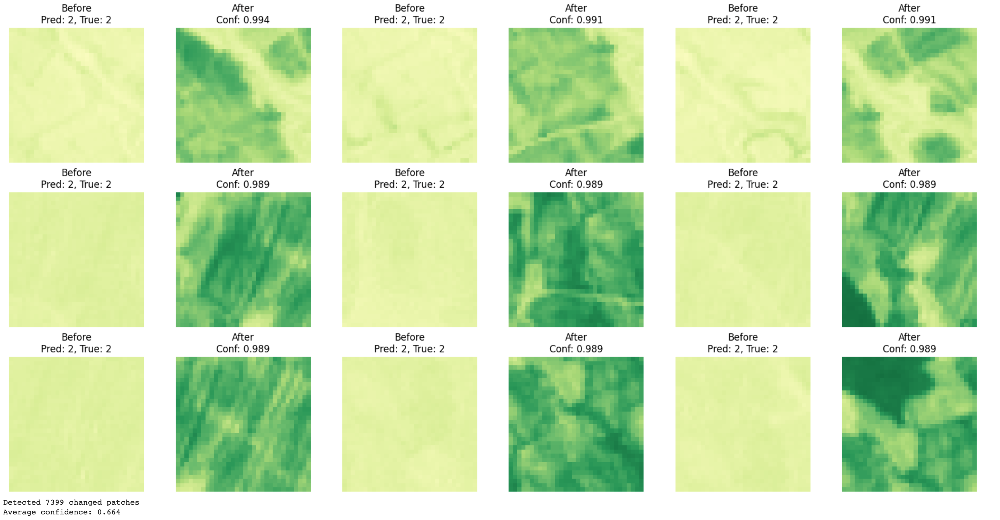

# Vegetation Change Detection with 3D CNN

This repository contains the implementation of a **3D Convolutional Neural Network (3D-CNN)** for detecting vegetation change using Sentinel-2 NDVI time series data.  
The project was developed as part of the **Google DeepMind Research Ready Scheme** (2025).

---

## Overview

Vegetation monitoring is crucial for assessing the environmental impact of flooding and land-use changes.  
This work uses a **weakly-supervised learning approach** with NDVI patches derived from Sentinel-2 imagery.  
The pipeline includes:

- Preprocessing Sentinel-2 imagery into NDVI patches.
- Patch extraction and Gaussian Process–based weak labelling.
- Training a lightweight **3D-CNN** model.
- Visualisation of detected vegetation changes.

---

## Results

- Model achieved **69.4% accuracy** on held-out AOIs.  
- Benchmarks from the literature (U-Net, 2D-CNN, 3D-CNN) achieve 65–96% depending on dataset and input size.  
- Visual examples demonstrate effective detection of vegetation loss.  

Example output (before vs. after NDVI patches, model detections):  

